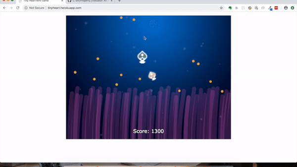

# TinyHeart Mini Game
This is a tiny browser game developed using HTML Canvas and front-end javascript. The game is mounted on NodeJS. Player will be able to play this real-time mini game in broswers

This mini browser game is now live on [heroku](http://tinyheart.herokuapp.com)

## User Story
 - As a player, you move your mouse across the gaming area to direct the movement of the big fish
 - Your job is to collect as mush fruits as possible on big fish and pass them to 'feed' baby fish
 - Everytime big fish touch a orange fruit, 100 point will be stored. Everytime big fish touch a blue fruit, all the 'pending fruit' point will be doubled
 - When big fish touch baby fish, all the 'pending point' will be redeemed as your score
 - Baby fish rely on big fish to feed. If baby fish does not received fruits within certain time, it will die and game over

## Live Demo


## Getting Started
 * Clone this repository
 * Install relative package
 ```
 npm install
 ```
* Start server
```
npm start
```

## Dependencies
  "dependencies": {
    "express": "^4.16.4"
  }
